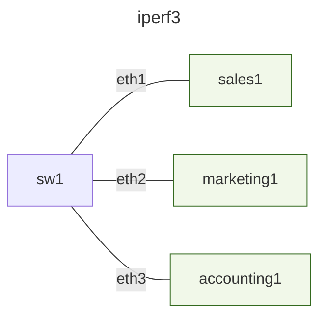

```mermaid
---
title: iperf3 
---
graph LR
  sales1["<fa:laptop> sales1"]
  marketing1["<fa:laptop> marketing1"]
  accounting1["<fa:laptop> accounting1"]
  

  classDef switch fill:#e3f2fd,stroke:#1565c0,stroke-width:2px;
  classDef host fill:#f1f8e9,stroke:#33691e;

  class sw1 switch
  class sales1,marketing1,accounting1 host

  sw1 ---|"eth1"| sales1
  sw1 ---|"eth2"| marketing1
  sw1 ---|"eth3"| accounting1
```

