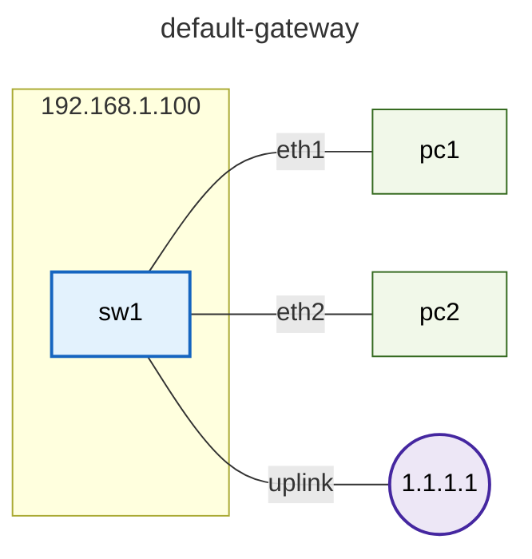

```mermaid
---
title: default-gateway
---
graph LR
  subgraph gw["192.168.1.100"]
    sw1["<fa:network-wired> sw1"]
  end

  pc1["<fa:laptop> pc1"]
  pc2["<fa:laptop> pc2"]

  internet((1.1.1.1))

  classDef switch fill:#e3f2fd,stroke:#1565c0,stroke-width:2px,color:#000;
  classDef host fill:#f1f8e9,stroke:#33691e,color:#000;
  classDef cloud fill:#ede7f6,stroke:#4527a0,stroke-width:2px,color:#000;

  class sw1 switch
  class pc1,pc2 host
  class internet cloud

  sw1 ---|"eth1"| pc1
  sw1 ---|"eth2"| pc2
  sw1 ---|"uplink"| internet
```
