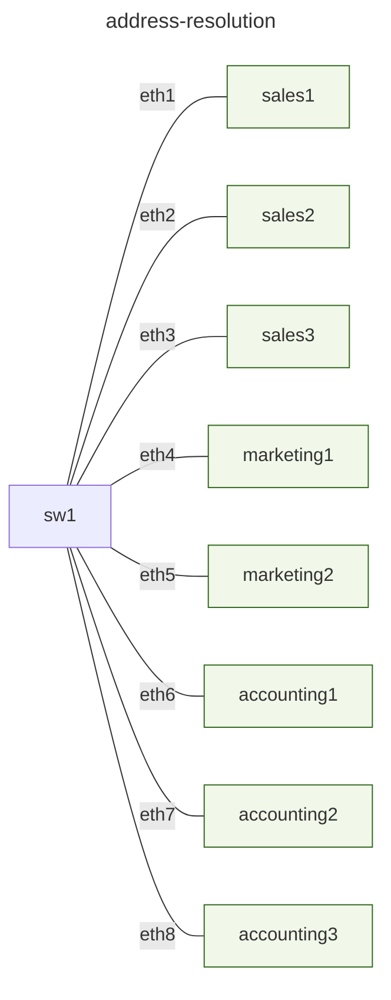

```mermaid
---
title: address-resolution
---
graph LR
  sales1["<fa:laptop> sales1"]
  sales2["<fa:laptop> sales2"]
  sales3["<fa:laptop> sales3"]
  marketing1["<fa:laptop> marketing1"]
  marketing2["<fa:laptop> marketing2"]
  accounting1["<fa:laptop> accounting1"]
  accounting2["<fa:laptop> accounting2"]
  accounting3["<fa:laptop> accounting3"]
  

  classDef switch fill:#e3f2fd,stroke:#1565c0,stroke-width:2px;
  classDef host fill:#f1f8e9,stroke:#33691e;

  class sw1 switch
  class sales1,sales2,sales3,marketing1,marketing2,accounting1,accounting2,accounting3 host

  sw1 ---|"eth1"| sales1
  sw1 ---|"eth2"| sales2
  sw1 ---|"eth3"| sales3
  sw1 ---|"eth4"| marketing1
  sw1 ---|"eth5"| marketing2
  sw1 ---|"eth6"| accounting1
  sw1 ---|"eth7"| accounting2
  sw1 ---|"eth8"| accounting3
```

